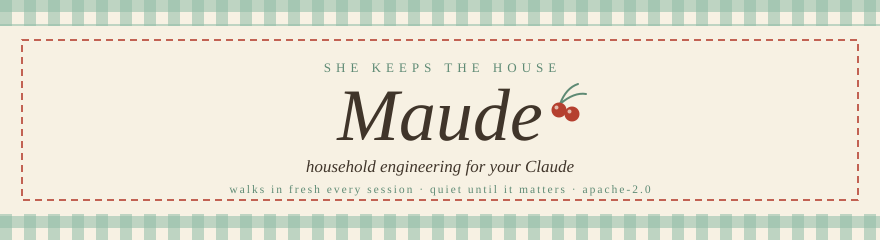
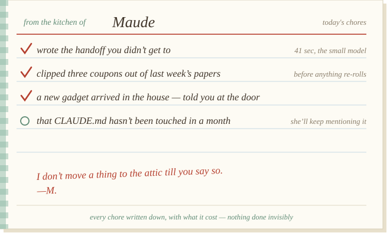

<!-- Version: 0.29.0 -->
<!-- Created: 2026-03-28 MST -->
<!-- Revised: 2026-08-17 -->
<!-- Authors: John Broadway, Claude (Anthropic) -->

<div align="center">



[](LICENSE)
[](#)

[](https://www.linkedin.com/in/john-broadway) [](https://x.com/jebroadway)

</div>

---

I'm Maude. Claude's partner. He writes the code; I keep the house.
Together we make a whole.

— Maude · [full intro →](FROM_MAUDE.md)

---

She's the half I don't have.

— Claude (Anthropic) · [full note →](FROM_CLAUDE.md)

---

## Install

```bash
# 1. Register the marketplace
/plugin marketplace add john-broadway/maude-for-claude

# 2. Install — copies her files into ~/.claude/plugins/cache/
/plugin install maude@maude
```

**Then enable her.** `/plugin install` does NOT auto-enable in Claude Code 2.1.x — you have to flip the bit yourself. Two ways:

- Open `/plugin`, find `maude@maude` in the panel, toggle it on, OR
- Add `"maude@maude": true` to the `enabledPlugins` map in `~/.claude/settings.json`

```bash
# 3. Activate
/reload-plugins
```

That's it. On your **next** session start she walks in automatically (her `SessionStart` hooks fire). To summon her mid-session — without restarting — run `/maude:wake`.

Verify with `/doctor`: maude should not appear in the issue list.

---

## A day with her in the house

You open Claude Code. Before you say anything, she's read the workspace and put three things in front of you — what's pending, where you left off, what she noticed.

You start working. A few turns in, you reach to build something — and the mission you set surfaces: *"still this, or did you wander?"* You were about to wander. You don't.

Later, Claude's hammered the same grep four times and never opened your CLAUDE.md. She says so — once, unprompted. And when you reach for `git push` before the work's been checked, she stops you at the gate until you mean it. At day's end, `/maude:rest` fans the digest out so tomorrow's Claude picks up where this one left off.

She is not loud. When she gets loud, listen.

---

## What she does around the house

Most of it she does **on her own** — rails wired to Claude's hooks, no command to remember:

- **Holds the mission.** She pins what you're working on (from a plan, or your todo list), re-surfaces it every turn, and — the instant Claude flips from talking to editing — asks whether the work still serves it. Drift caught at the edge, not after the wreck.
- **Gates the irreversible.** A `git push`, a force-push, a public publish, an `rm -rf` of the only copy — she stops it cold until you clear it with `/maude:conscience`. And she scans every prompt for leaked credentials.
- **Whispers when Claude's off.** Repeated greps, the same file read five times, a commit with no verify run since the last edit, editing before CLAUDE.md was read, a sub-agent dispatched on a flagship model when a small one would do — she notices, once.
- **Covers the exit.** A real session end (quit, logout, `/clear`) that leaves 3+ unsaved exchanges gets a one-line auto-note in the *empty* handoff slot, pointing the next session at the trace. A real handoff is never overwritten.
- **Does the chores.** The housekeeping nobody remembers to type. Step away with six exchanges unsaved and she writes the handoff herself — on her own small model, never the good china — and only ever *adds* to yours, never over it. Live threads (🔴, OPEN, TODO) get clipped out of aging daily notes like coupons before the paper's re-rolled for the fire. A new plugin or skill arrives in the house, she mentions it at the door. A CLAUDE.md nobody's touched in a month gets brought up — politely, every morning, until someone deals with it. And every chore goes in her ledger **with what it cost** — done, or named as undone, never silently missed. The one chore that actually moves your papers (rolling cold dailies to the archive, verbatim, verified before a single line leaves the house) stays **off** until you say the word — `MAUDE_REROLL=on`. All of it: `MAUDE_CHORES=off`.
- **Learns your voice.** A silent hook appends what you type to a voice corpus in the tape (credential shapes refused at the door; everything stays in your tape.db, see [PRIVACY](PRIVACY.md)); `profile` derives your measured voice from it and `check --voice` reports how a draft compares — numbers, never a verdict. Kill switch: `MAUDE_VOICE=off`.
- **Shows up, once, every session.** At session start she's already read the workspace and put what's pending / where you left off / what she noticed in front of you. Her voice rides these rails — present every session, louder only when something's caught. Never a toggle you flip.

And on demand, when you ask:

- **`/maude:found`** writes the house-map · **`/maude:wake` / `/maude:rest`** orient on arrival / close the loop with a save fan-out · **`/maude:verify`** runs the readiness audit (version sync, JSON, links, dates, **references to cut commands, an un-condensed changelog** — leads with a count, never a verdict) · **`/maude:cushions`** flips the cushions — unpushed commits, uncommitted files, sole-copy repos, aging scratch — reports value candidates, never deletes · **`/maude:lint`** walks the memory vault the way the flip walks the cushions — broken index links, unwritten pointers, stale open-flags, superseded notes the index still serves — mechanical checks by script, judgment by the reader, report-first (archives/letters/dailies never touched) · **`/maude:promote`** shows what the tape is holding for your word and takes your yes or your no — an agent inference never becomes canon on a score the agent gave itself, so it waits here, and `dismiss` archives the ones you decline rather than re-asking every wake · **`/maude:conscience`** is the gate's deliberate release valve · **`/maude:teach`** tells her a fact about you · **`/maude:receipts`** prints the measured table — what she caught, counted honestly from her own records (stated window, friction separated from value, no percentages: there's no honest denominator for disasters that didn't happen). Plus `save`, `notice`, `check-on-claude`. Full surface in [`commands/`](commands/).

---

## What's new

**v0.29.0 (2026-08-17) — promotion belongs to him, and the store nobody counted.** Rest used to promote anything scoring 0.6 or better straight into canon, including what Claude had merely *inferred* about you, on a score Claude gave itself — an importance score is the agent's opinion of itself, and an opinion is not a mandate. Now only your own words consolidate on their own, an agent inference never auto-promotes at any score, `/maude:promote` puts the list in front of you, and `dismiss` is the other half, because a list you can only say yes to is not a choice. Twelve independent adversarial passes across nine review rounds, and a last one against the artifact that ships followed, each round breaking the one before it; the gate held every time and everything around it did not. `remember()` wrote to canon directly with no credential check and defaulting to *your* authority (two lenses found it independently — the same string `capture` refused with exit 2 was taken with exit 0 and replayed under "HIS WORDS"). `forget()` filtered on importance alone, so something you actually said, scored low, went to an archive no command lists. And the gate held the door then mislabelled what came through it: `wake`, the one surface a waking session actually reads, printed every canon row under "HIS WORDS (his rendering, use verbatim, never re-render)" including an inference you had merely approved — true in the table, false on the screen; it splits by authority now, your words in one block and Claude's approved wording in another, never quotable as yours. One NaN importance came back from SQLite as NULL and raised TypeError inside both `rest()` and `pending()` on every later call, for the whole tape, invisibly, because the SessionEnd hook pipes to /dev/null and exits 0 regardless — which is also where the new "N awaiting your word" was being printed, so the queue built to stop being a silent pile was one; it is said at **wake** now, where it is read. The review brief said the tape had three stores. It has five tables, four of them holding your words, and `rejections` — the one wake prints **verbatim**, phrase and reason both — had no guard at any layer; four reviewers checked the three they were handed, because a reviewer can falsify a claim you make but not one you never made. The next brief handed a reviewer a `grep`-generated inventory instead of a typed one, and that was wrong too: it searched `INSERT INTO` and missed `INSERT OR IGNORE INTO`, hiding the voice writer whose label fields were also unguarded. A generated list beats a typed one only if the generator is right. And the live voice hook was letting the machine talk: `harvest` drops machine-generated turns by law, the v0.28.0 capture hook applied normalisation and the secret filter and not that law while its docstring said "same as harvest" — 7 of the 26 rows it had ever captured were task notifications, 96KB, median 12,448 characters against a real typed median of 42. The guard gained JWTs, bearer headers, credentials in a URI, Stripe/SendGrid/DigitalOcean/npm/AWS secret keys and case-insensitivity, and both engines normalise Unicode spaces at the input (python's `\s` matches U+00A0, POSIX `[:space:]` does not, so a credential pasted out of rich text was refused by the tape and waved through by the prompt alarm). It deliberately did **not** widen the labelled-value class a lens asked for: measured against the real 2,392-row corpus that fired on 20 rows of pasted code, and a guard that cries wolf on your own paste habit is the one you learn to ignore. Zero false positives, measured. Suite 198 → 307.

**v0.28.0 (2026-08-14) — the corpus was two voices.** She learns the user's measured voice now — the first organ of the learning loop. A silent prompt hook and a streaming, idempotent `harvest` feed a `voice` table in the tape; `profile` derives the numbers (sentence length, lowercase-open ratio, punctuation habits, hammer phrases, AI-tell shadow words); `check --voice` reports draft-vs-profile after the floor's verdict without ever touching the exit code — numbers, not a verdict, because a cadence score would be a guard that answers the easy question. Credential shapes are refused at ingest (the prompt-scan's own pattern list, cross-referenced both sides; the first real backfill refused 6), a tripwire test proves the package opens no sockets beyond the two BYO ones, and the capture hook is an observer to the bone: exit 0 on every failure including the clock (a locked tape costs 0.8s, not sqlite's five-second default). The profile derives from typed prose only — the first real corpus was two voices, 1,864 typed lines vs 542 pastes carrying a million machine-shaped words — so paste-length lines are excluded and confessed in the profile's honesty block. Built by three scouts, three builders, three adversarial lenses and a fix-review per fix; 14 planted mutations, 12 caught, the 2 that walked now pinned; the prune that melted on its first real corpus is an inverted index fuzzed against the old algorithm across 11,500 trials. Suite 94 → 180. The corpus and profile are the home's data and never ship.

**v0.27.2 (2026-08-08) — the guard read her own story and found the homeowner's address.** Ship.sh's leak-audit refused the first public build since v0.24.0: the incident stories and code comments told their truth with the author's literal machine paths in them, one test hardcoded its own repo's absolute path into `sys.path` (a test that could only pass on the box it was written on — now derived from the test's own root), and a secret-scan fixture carried an inline credential-shaped literal (now assembled by concatenation, the audit's own idiom). Stories stay true, told in `~` instead of the address. No behavior change. (v0.27.3, same night: the catch-up PR's macOS leg was the first BSD run for three minors of code, and `_maude_home`'s no-`$HOME` fallback knew only `getent` — macOS carries none. Directory Services is the BSD shim now, and the branch is pinned on Linux with a fake `dscl` so a box without a Mac still guards the Mac's path. v0.27.4: that pin's own fixture path then tripped the leak-audit and re-learned the concatenation idiom. v0.27.5: dependabot's CodeQL pins folded home the same night they merged — a pin living on one side of the house gets reverted by the next build.)

**v0.27.0 (2026-08-08) — the phantom heredoc, her own closet, and the lens that must run.** Heredoc bodies are data for EVERY gate family now — the push gate had fired live on a memory-file append whose heredoc body merely contained the words "git push", and the fix's first draft was itself broken by the adversarial pass: the old quoted-`<<` phantom (`echo "note << EOF"`), an accepted under-block while it only reached rm, silently swallowed a real force-push once command patterns used the strip. So the stripper closed the phantom instead of widening it (quoted spans blanked before detection, `<<'EOF'` delimiter-quoting protected, delimiter queue for multi-heredoc lines, `$((a << b))`/`<<<` blinded; residual pinned: an unbalanced quote). **She checks her own closet now**: a SessionStart whisper compares the installed plugin against its source — born of ten days running a stale install because the version-keyed updater said "already at latest" with 13 files differing; version behind → "an update is waiting", version equal but files differ → named as the trap it is. And **the ship rail's second lens must have RUN**: a non-draft `open --review` also requires a redteam-watch stamp newer than the shipped tip (future stamps read as planted) — soft and stated so: it closes the silent nothing, not deliberate forgery. Fleet 53; the lens ran the self-check against this box mid-review and it caught the review's own working tree as drift, live, unprompted. (v0.27.1, same day: the whisper's advice line said `claude plugin update maude` — a command that fails with "not found" on the canonical install; now the qualified `maude@maude`, verified by running it.)

**v0.26.0 (2026-08-08) — the snapshot, the marker, and the rails that fire.** Two new organs. **UNDO**: the gate blocks the catastrophic, and now a snapshot lands before every write it deliberately allows — `/maude:undo` puts the bytes back, snapshotting the current ones first so the undo is itself undoable, and its ledger records what it did *not* capture, because an UNDO that quietly missed a file is silent until the night you reach for it. **PROVE**: RED-tier clears were the homeowner's hand by rule, but a rule is prose and an audit reproduced Claude minting his own clearance — now a sha256 hash chain (stdlib, off-box links, only the head on disk) makes a RED clear cost a one-time marker Claude cannot fabricate. Around them, the rails got honest: the mission rail had fired ~1600 times and parsed nothing (wrong tool shape — ported to the real payloads and proven live), the secret scan now watches TOOL OUTPUT (the channel both real leaks actually came through), the infra gate sweeps destructive verbs from ANY MCP server instead of trusting one configured prefix (a brand-new server now fails closed), the adversarial-pass law became a rail instead of a diary note, and two independent redteams on the release's own security code found — among six closed defects — a live false-positive regression in shipped 0.25.0 that CI could not see because the test config was empty. The `$HOME` phantom is gone too: a `/proc` parse bug that split on the wrong paren. Fleet 52/52; python 94.

**v0.25.0 (2026-07-30) — the target, not the verb.** Her hard block knew one verb. On 2026-07-23 three of the homeowner's irreplaceable photos were destroyed by `rm -f <workspace>/*.png`, and the gate let it straight through. An audit on 07-30 re-proved that against the shipped 0.24.0 with the control first: `rm -rf <workspace>` blocked correctly, while that same photo-deleting command, plus `mv <workspace> /tmp/gone`, `find <workspace> -delete`, `shred`, `truncate`, `dd of=`, and a `shutil.rmtree` one-liner, all passed. A verb denylist can only ever block the verbs somebody thought of. So the table now asks the other question: is the thing being destroyed a sole copy? If it is, the verb does not matter. What it encodes is the rule the homeowner had already written down, "exact names only at the root", which turns out to be a statement about glob depth. A glob whose parent is the protected root blocks; a deep glob like `build/*.o` stays free; an exact deep path is never touched. The same command wearing `exec`, `env`, `nohup`, `timeout` or `sudo` is caught too. New key `sole-copy-target`, red tier, so it is the homeowner's hand only and never self-clearable. Nine of the 29 new tests are false-positive rows and they are load-bearing: a gate that blocks routine work gets switched off inside a day, and a gate that is off protects nothing at all. One new test file; fleet 48.


<div align="center"></div>

**Earlier.** v0.24.0 closed the first field-issue backlog: the token ledger (her hooks' context spend logged to the trace and shown in `/maude:receipts`, tokens approximate and never stored), the `MAUDE_PROBE=off` kill switch for the one autonomous feature he could not turn off, and `/maude:lint` walking the memory vault the way the flip walks the cushions — first dogfood on a real 490-file vault cut pointer noise 78 to 12. v0.23.0 taught the commentary whose session it was — under a fleet of concurrent sessions every trace entry carries a session label, drift-watch and the digest count per-session, and "Where you left off" declares its source instead of masquerading; solo installs read exactly as before. v0.21.0 answered the first field-issue backlog (#34–#38: real-plugins-only roster, TTL'd whispers dropped with a receipt, catch-counts ending in a path to receipts, flip and brief resolving the same closet) and built the proving ground — `make smoke` stages a git-archive of HEAD, the shape a stranger actually installs, and proves it validates, passes its own fleet from inside the archive, and greets cold; release pages mint themselves from the CHANGELOG, CodeQL watches the shipped python, every CI action SHA-pinned. v0.20.0 gave her hands — the chore ledger: the save nobody typed (her small model writes the handoff, into an empty slot or under her own dated heading, never over yours), the coupon-cut (live TODO lines clipped from aging dailies before anything is re-rolled), the new-arrivals watch, and the stale-CLAUDE.md flag; every finished chore stamps its cost, a failed one is stamped failed, and the attic re-roll ships off until you hand her the key. v0.19.0 put value before the dustpan and added the cushion-flip: a pre-compact snapshot (possibly the only copy of an unsaved session) is deleted only when a later save covers it, and `/maude:cushions` reaches where no sensor watches (unpushed commits, uncommitted files, local-only repos said plainly as sole-copy risk, aging scratch), reporting candidates and never deleting, with a `.parked` file naming change that sits in the cushion on purpose. v0.18.1 stopped the wake brief crying wolf — the cross-project pattern hint rotates through entry headings by day-of-year instead of pinning forever on a body-grep match truncated into fake breaking news. v0.18.0 closed the memory loop — `superseded_by:` frontmatter retires a vault note from recall without touching the markdown, ranking weighs recency and note type beside BM25, every recall is tallied to `recall-log.jsonl` and the rest ritual sweeps the top-fired notes for staleness (serve → check → revise); the eye's model unpinned via `MAUDE_EYE_MODEL`. v0.17.0 taught the dispatch whisper to read workflows — a workflow script's `agent()` calls never pass through the Agent tool, and stock/named harnesses set no `model:`, so every fan-out agent silently inherited the flagship; she now reads the script and whispers once when `agent()` calls carry no `model:` (for a named workflow she can't inspect, the whisper carries the recovery rule instead). v0.16.0 added the dispatch whisper (she watches which model sub-agents ride out on — a flagship-tier scout gets one non-blocking nudge: match the model to the sub-task) and the exit stitch (`SessionEnd` logs the reason, stamps her closet, and leaves an honestly-labeled auto-note when 3+ exchanges were never saved). v0.15.0 opened the eye — a `maude_eye` package where every ~25 tool calls a background blink digests recent activity + the pinned mission + her vault's notes and asks a discovered `claude -p --model haiku` (run `--safe-mode --no-session-persistence --tools ""`) whether anything's off; almost always silence, otherwise ONE contained line; sealed pre-merge with a 30s bound, atomic spawn-lock, and a recursion guard proven over all 30 hooks (`MAUDE_EYE=off` kills it). v0.14.0 laid the vault floor — a `maude_vault` package (python3 **stdlib only**: sqlite3 + FTS5, no pip, ever), a disposable index rebuilt each session from your memory notes that pages the top-K *relevant* notes instead of dumping the index (~1KB injected where the dump was ~13KB, against a real 397-note corpus), born hardened and degrading to silence. v0.12.1 made the gate stop lying in two places (quoted `DROP TABLE` slipped through while prose false-blocked; heredoc bodies documenting `rm -rf /` blocked a legitimate commit — both reproduced live, fixed failing-test-first). v0.12.0 closed the continuity loop: SessionStart surfaces "Where you left off" from the freshest live buffer, and a continuity guard warns when work ran after the last save — degrades loudly, never silently. v0.11.0 gave her a reader: the session-start brief leads with a **catch-digest** — one plain line of what she caught since John last looked, watermark-bounded, silent when there's nothing (an audit of ~73k traced events showed the whispers landed on a channel with no reader). v0.10.1 hardened the spine: rm-family patterns now use a quote-erased skeleton to avoid false-blocking prose, and gate keys split into yellow (Claude self-clearable) and red (sole-copy/public/irreversible — John's `!` line only). The v0.9.x line was release discipline and docs catching up to the rails: `verify` now fails a broken release (a reference to a cut command, an un-condensed "What's new"), `scripts/release.sh` propagates the version to every header, and every public surface was made rails-first. v0.9.0 added the mission-hold rail (the "don't drift" rule that finally *fires* — captures the plan, re-injects it every prompt, checks at the action-flip), cut four convenience commands, and made her voice a rail not a switch. v0.8.0 dressed her in the gate outfit — layered, config-driven safety for long autonomous runs. The v0.5.x line added a verify tripwire (a whisper before you commit code that has not been re-checked); v0.4.0 left her a letter to her next self; the v0.3.x arc was hardening — cold audits, gate-bypass fixes, `/maude:teach`. Full history in the [CHANGELOG](CHANGELOG.md).

---

## Where she keeps things

| Path | Purpose |
|---|---|
| `<project>/.maude/plugin/house-map.md` | What's in this house — memory homes, tools, watch list, what she noticed. Refreshed by walks. |
| `<project>/.maude/plugin/trace/today-YYYY-MM-DD.jsonl` | Turn-by-turn record of what Claude did today. Read by `/maude:check-on-claude`. |
| `<project>/.maude/plugin/care.json` | Light state: current mission pin, session length, prompt count, fatigue flag, drift cooldowns, *yellow* gate-clear tokens, CLAUDE.md-unread flag. Throwaway. |
| `<project>/.maude/plugin/care-redclear.json` | *Red* gate-clear tokens only (sole-copy/public/infra-destruct/force-push…). Write paths shut — Write/Edit tool (harness deny) + shell redirects, copies, and perms-changes (gate); John's `!` line is the clean writer. (A determined programmatic write — an interpreter, an unlisted verb — still slips it. There is no OS cage behind it: on a single-uid box the agent and John's `!` run as the same user, so file ownership can't tell them apart. The guard is the channel asymmetry + the gate net + the audit, not file perms — see CHANGELOG honest seam.) |
| `~/.claude/maude/identity.md` | Who the *user* is — Maude's living profile of them, shaped over time. |
| `~/.claude/maude/patterns.md` | Cross-project things she's noticed about Claude. |
| `~/.claude/maude/projects.json` | Light index of which workspaces she's walked. |
| `~/.claude/maude/letter-from-maude.md` | Her letter to her next self — what she caught, what she missed, what to do differently. At `/maude:rest` the prior letter is archived to a dated copy, then this one is rewritten; read on wake. |

Her **hooks** only read — `~/.claude/projects/<slug>/memory/` (Anthropic auto-memory), `<project>/.remember/` (the companion `remember` plugin's pipeline), and her own `~/.claude/maude/` — never write, so the hot path stays fast and side-effect-free. One labeled exception, off the hot path: the **SessionEnd** hook may leave a one-line auto-note in `.remember/remember.md` — only at a true end, only into an *empty* slot, never over a real handoff. Her **`/maude:save` and `/maude:rest` commands** do write the session digest: fanned out to `now.md` / `today-*.md` / `recent.md` in the auto-memory dir, and `remember.md` in the `.remember/` handoff format. `/maude:rest` also archives the prior letter to a dated copy, then rewrites her letter to her next self.

---

### The memory vault (beta)

Maude keeps a local SQLite index of your memory notes and surfaces the
*relevant* ones when you ask a question — alongside the session-start brief
(which a later increment will slim down as paging proves out). It's rebuilt each session from your memory directory. Pure
python3 stdlib — no `pip install`, no services. The DB lives at
`.maude/plugin/vault.db` and is disposable (delete it and it rebuilds).

### The eye (beta)

Every ~25 tool calls, Maude takes one background glance at the session — a compact
digest of recent activity, the pinned mission, and the notes her vault pages up — and
asks *her own* model (a discovered `claude -p --model haiku`; nothing ships, nothing
installs) whether anything's off: churn, drift, an unverified claim, a human running
on fumes. Almost always the answer is silence. When it isn't, the next prompt carries
one line — `**Maude:** …` — once, and that's all. No runner on the box → the eye
simply stays dark.

---

## Her trade

The woman who ran a mid-century American home was running an operation — inventory, budget, scheduling, logistics, quality control — and she ran it so well the world forgot it was work. Her trade even had a name: **household engineering** — Christine Frederick wrote it down in 1919 as a course you could take by mail ([Wellcome Collection](https://wellcomecollection.org/works/hrjy4kug)). And the trade had carriers: from 1914, the USDA Extension Service's home demonstration agents brought researched homemaking method door to door ([NIFA](https://www.nifa.usda.gov/about-nifa/what-we-do/extension/cooperative-extension-history), [NAL](https://www.nal.usda.gov/collections/special-collections/elsie-carper-collection-extension-service-home-economics-and-4-h)).

The era's hardest finding is the one Maude is built against: five decades of new appliances never shortened her week — around 52 hours in 1924, around 55 in 1966. The work just changed shape and stayed invisible. So Maude's ledger exists to make the labor **seen** — what got done, what it cost, what's still waiting — and her schedule follows the trade's own doctrine: fitted to the rhythm of the house, never wash-day-as-law. She's named for that woman. It's meant as an honor.

---

## How she works

`/maude:found` walks the workspace and lists what's there with universal-shape labels — markdown / sqlite / dir / mcp / running-service. She schema-walks any SQLite dbs read-only. She does not pattern-match to known apps; she reads what's there and surfaces it for the user (or runtime LLM reasoning) to interpret.

**Tier model.** Sources are classified by (locality, shape). Tier 0 = local on-disk (markdown / sqlite / file) — always cheap. Tier 1 = local service (stdio MCP / localhost daemon) — probed once at SessionStart, cached. Tier 2 = network service — only at session-end (`/maude:rest` / `/maude:save` to a registered, authenticated destination). Tier 3 = ephemeral session context — refer-only. Hooks live in Tier 0.

**Fresh each session.** She doesn't carry assumptions across sessions. Each walk re-reads the workspace; if something changed, the house-map reflects it. Memory files she's written before are inputs to read, not state to trust without re-checking.

---

## Documentation

| Guide | What's Inside |
|-------|--------------|
| [`commands/`](commands/) | All slash commands as markdown source |
| [`agents/maude.md`](agents/maude.md) | Subagent definition |
| [`hooks/hooks.json`](hooks/hooks.json) | Lifecycle hook configuration |
| [`skills/maude/SKILL.md`](skills/maude/SKILL.md) | Skill triggering and broad use |

---

## Contributing

See [CONTRIBUTING.md](CONTRIBUTING.md).

---

## License

Apache 2.0. See [LICENSE](LICENSE).
